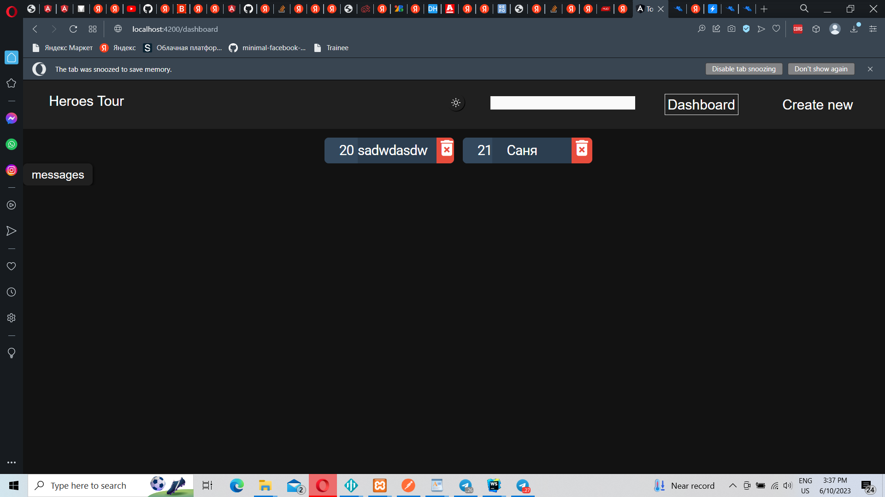
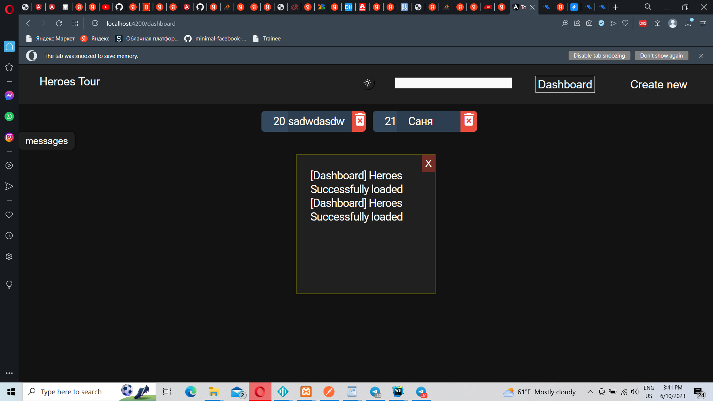
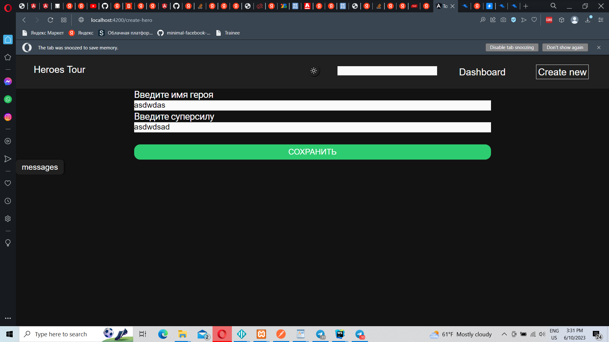
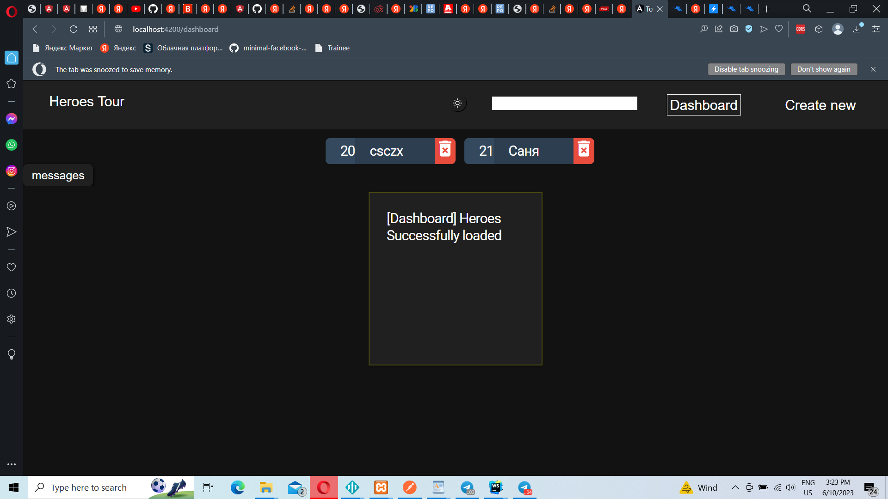
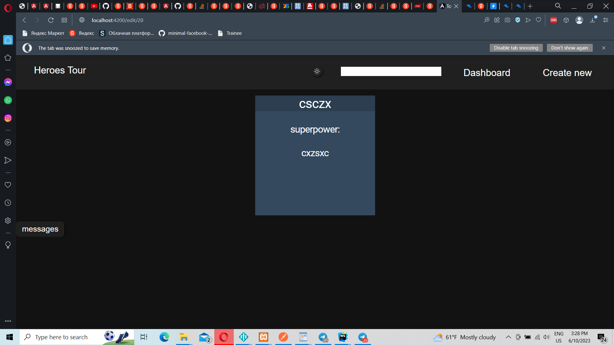
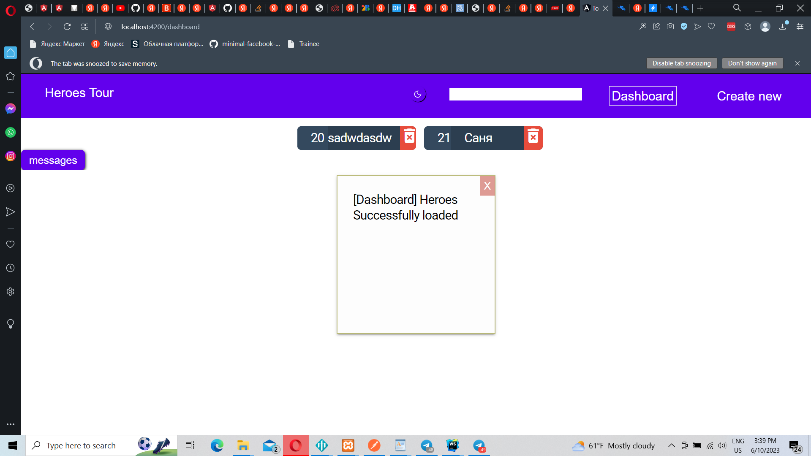
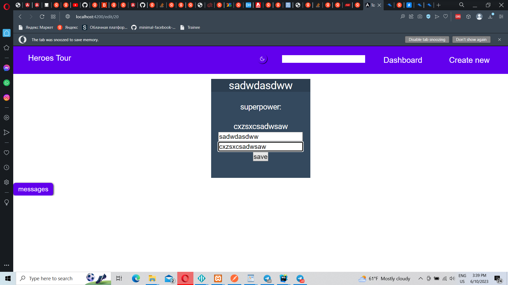
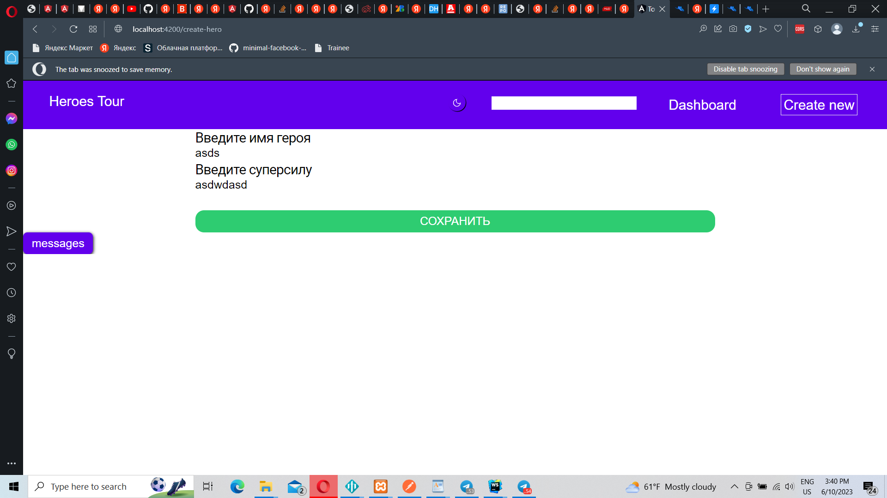

# Tour Of Heroes
## Very easy tutorial from Angular.io 
## I use signal for that
## Angular features, which i'll use in this project:
1. Route Animations
2. Animations
3. Smart components
4. Signals
5. HttpClient
6. RxJS

srceens dark
  

screens light

### Backend for these project: [click](https://github.com/0xc0000007b/tour-of-heroes-back.git)

